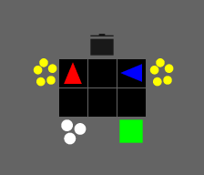

# JAXOvercooked
Implementation of multiple Multi-Agent Reinforcement Learning (MARL) methods on the overcooked environment using JAX.




## Install
First create a virtual environment 
``` 
python3.10 -m venv .venv
```

Second, activate this virtual environment:
### Unix systems: 
``` 
source .venv/bin/activate
```
### Windows systems:
``` 
.venv\Scripts\activate.bat
```

Then, install the requirements: 
``` 
pip install -r requirements.txt
```
(for Mac: first remove the [cuda12] in requirements.txt)

Another option is to install with conda:
```
conda create -n jaxovercooked python=3.10
conda activate jaxovercooked
pip install -r requirements.txt

### to run on vscail server:
mkdir -p ~/overcook
cd ~/overcook
git clone git@github.com:LukavdBoogaard/JAXOvercooked.git  # this repo
cd ~/overcook/JAXOvercooked
conda create -n jaxovercooked python=3.10
conda activate jaxovercooked
pip install -r requirements.txt
### then install a lower version of jax, v0.6.0 gave errors:
pip install "jax[cuda12]==0.4.25" "jaxlib==0.4.25+cuda12.cudnn89" -f https://storage.googleapis.com/jax-releases/jax_cuda_releases.html
# hmm, .. this one still gives errors. Not sure which version is best
mkdir -p /data/$USER/overcook_logs/console_outputs
### ready to run:
bash scripts/vscail/train_all.sh
## to check on which GPU your job is running:
nvtop 
## to check output logs (change to your file, see bash output):
nano /data/bgrooten/overcook_logs/console_outputs/exp_mm_2025-05-14_103142_exp1.out  
```


## Running IPPO
After installing, the IPPO implementation can be run from the base folder:
```
python -m baselines.IPPO_original
python -m baselines.IPPO_continual
```


